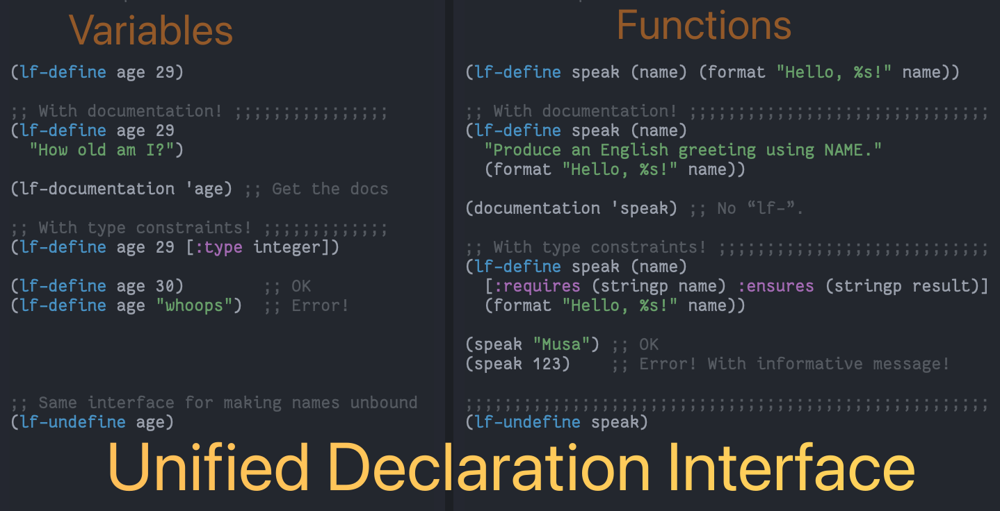

# Table of Contents

1.  [Summary](#Summary)
    1.  [Installation Instructions](#Installation-Instructions)
    2.  [Bye!](#Bye)
2.  [Example](#Example)

(•̀ᴗ•́)و

# Summary

<table border="2" cellspacing="0" cellpadding="6" rules="groups" frame="hsides">

<colgroup>
<col  class="org-left" />

<col  class="org-left" />
</colgroup>
<thead>
<tr>
<th scope="col" class="org-left">“L”anguage “F”eature</th>
<th scope="col" class="org-left">Implementation</th>
</tr>
</thead>

<tbody>
<tr>
<td class="org-left">Singular interface for variable &amp; function definitions</td>
<td class="org-left"><code>lf-define</code></td>
</tr>

<tr>
<td class="org-left">Interface for <i>typed</i> variables &amp; functions</td>
<td class="org-left"><code>lf-define</code></td>
</tr>

<tr>
<td class="org-left">Singular interface for unbinding variable &amp; function names</td>
<td class="org-left"><code>lf-undefine</code></td>
</tr>
</tbody>

<tbody>
<tr>
<td class="org-left">Singular interface for documentation retrieval &amp; assignment</td>
<td class="org-left"><code>lf-documentation</code></td>
</tr>
</tbody>

<tbody>
<tr>
<td class="org-left">Helper utility for <code>&amp;optional</code> and <code>&amp;rest</code> arguments</td>
<td class="org-left"><code>lf-extract-optionals-from-rest</code></td>
</tr>
</tbody>
</table>

    (documentation 'lf-define)

                  

                    <strong>
                      
                         lf-define --documentation
                      
                    </strong>
                  

lf-define  ≈  setq + defvar + defun + setf.

This is a unified variable/function definition interface.

1.  It can be used to define both variables and functions.

    (lf-define age 29 "How old am I?")

    (lf-define greet (name)
      "Say hello to NAME"
      (message-box "Hello, %s!" name))

    The documentation string for variables is optional, as with functions.

2.  It can be used to define **constrained** variables.
    The following two uses are equivalent; the first uses **type specifiers**,
    whereas the second uses an arbitrary predicate with the name ‘it’ referring
    to the name being defined.

    (lf-define age 0 (:type integer (satisfies (lambda (value) (<= 0 value 100)))))

    (lf-define age 0 (and (integerp it) (<= 0 it 100)))

    Initial/new values not satifying the requested constraints result in an error.

    If no constraint is declared, then the ‘lf-define’ is considered to be an update
    and so the most recent constraint is used to check the validity of the new value.
    (Constraints are kept in the variable’s property list.)
    Constraints are also checked whenever the variable is set with ‘setq’.

    If a constraint is declared and the initial value does not sastisfy it, then
    the name being defined is made unbound, not defined at all.

    (lf-define age 0 (:type nil)) ;; Error; ‘age’ now unbound.

3.  If PLACE is a non-atomic form, then we default to using ‘setf’.

    (lf-define foods ’(apple banana))

    (lf-define (car foods) ’pineapple)
    (assert (equal foods ’(pineapple banana)))

    (documentation 'lf-undefine)

                  

                    <strong>
                      
                         lf-undefine --documentation
                      
                    </strong>
                  

Ensure SYMBOLS are undefined, as variables and functions.

Zeros out var’s plist and deletes associated variable watchers.

Useful for testing.

(fn &body SYMBOLS)

    (documentation 'lf-documentation)

                  

                    <strong>
                      
                         lf-documentation --documentation
                      
                    </strong>
                  

Essentially, ‘lf-documentation’ ≈ ‘documentation’ + ‘documentation-property’.

By default, Emacs Lisp’s ‘documentation’ returns the function documentation of
a given symbol. As such, ours will be biased towards variable documentation.

(lf-documentation NAME ’function)  ≋  (documentation NAME)

    (documentation 'lf-extract-optionals-from-rest)

                  

                    <strong>
                      
                         lf-extract-optionals-from-rest --documentation
                      
                    </strong>
                  

Provide a way to support &optional and &rest arguments of a particular shape.

For example, in ‘defun’ one may provide an optional docstring;
likewise in ‘lf-define’ one may provide a docstring but no vector
of constraints, or any other such mixture. This metod ensures the
right variable refers to the right thing.

Return a list of length 3: The first being a vector or nil, the
second being a string or nil, and the last being a list.

VEC and STR are the values of &optional arguments that
are intended to be a vector and a string argument, respectively.
REST is the value of a &rest argument; i.e., a list.

## Installation Instructions

Manually or using [quelpa](https://github.com/alhassy/emacs.d#installing-emacs-packages-directly-from-source):

    ;; ⟨0⟩ Download the lf.el file manually or using quelpa
    (quelpa '(lf :fetcher github :repo "alhassy/lf"))

Not yet on Melpa&#x2026; awaiting approval.

## Bye!

# Example

This example comes from `tests.el`, our test suite.

Let's define a function and place some constraints on its inputs and output&#x2026;

    (lf-define speak (name age)
        [:requires (and (stringp name) (integerp age))
         :ensures (stringp result)]
        "Greet person NAME with their AGE."
        (format "Hello %s year-old %s!" age name))
    ⇒ speak

    ;; Docstring is present
    (documentation-property 'speak 'function-documentation)
    ⇒ "This function has :around advice: ‘lf--typing-advice/speak’.

    Greet person NAME with their AGE.

    (fn NAME AGE)"

    ;; Type-satisfied inputs yield an output
    (speak "musa" 29)
    ⇒ "Hello 29 year-old musa!"

    ;; Type-invalid inputs yield an error
    (speak 'musa 29)           ;; i.e., symbol ≠ string.
    ⇒  "Error: Requirements for “speak” have been violated.

       REQUIRED:
       (and
        (stringp name)
        (integerp age))

       GIVEN:
       ((name = musa : symbol)
        (age = 29 : integer))   ")

If we had defined our function incorrectly; i.e., not adhering to the
constraints then we are notified whenever we call it!

    (lf-define speak (name age)
        [:requires (and (stringp name) (integerp age))
         :ensures (stringp result)]
        "Greet person NAME with their AGE."
        123) ;; Whoops, we implemented the wrong thing: Result is not a string!
    ⇒ speak

    ;; An informative message whenever we try to use our poorly implemented function
    (speak "Musa" 29)
    ⇒  "Panic! There is an error in the implementation of “speak”.

    Claimed guarantee: (stringp result)

    Actual result value: 123 ---typed: integer"
    Mark set

There are more examples in `tests.el`.
